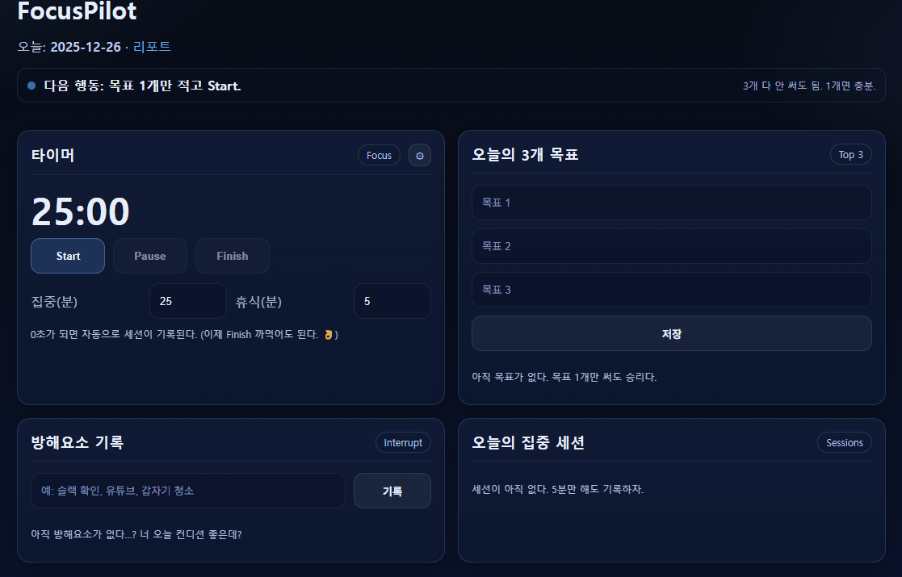
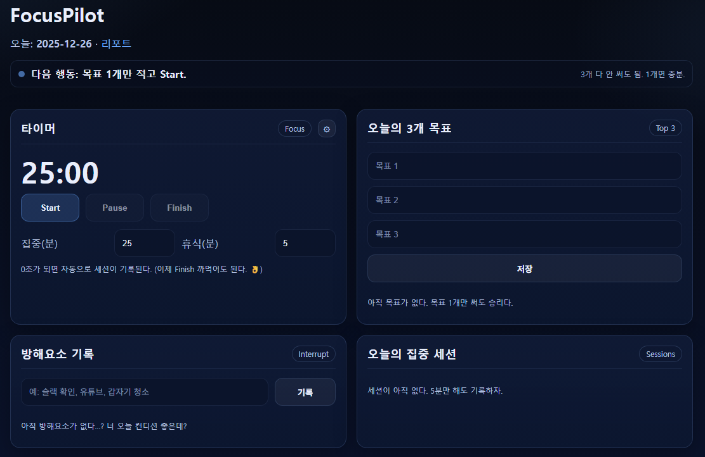
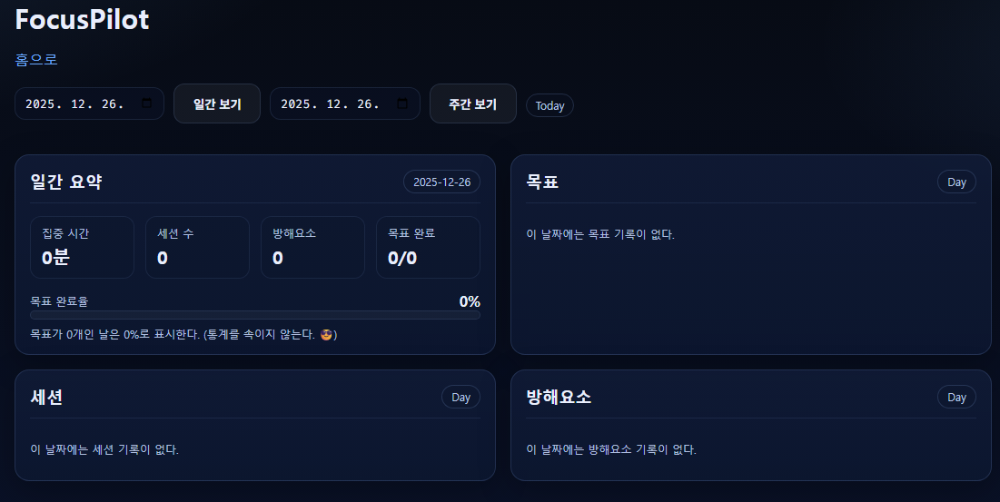

# FocusPilot (v0.2)

ADHD 집중 코치: **타이머 + 오늘의 3개 목표 + 방해요소 기록 + 리포트(날짜/주간)**  
"다음 행동 1줄 가이드"로 **지금 해야 할 일을** 자동으로 안내합니다.

---

## Demo



---

## Screenshots

| Home | Report |
| --- | --- |
|  |  |

## Features
- **Pomodoro 타이머(집중/휴식)**
  - 0초 도달 시 **집중 세션 자동 기록**
  - Focus ↔ Break **모드 자동 전환**
  - 소리/데스크톱 알림(옵션), 자동 휴식(옵션)
- **오늘의 3개 목표**
  - TODO/DONE 토글
  - 목표는 **날짜별로 저장** (이월 없음)
- **방해요소 기록**
  - 한 줄 기록으로 흐름 복귀 지원
- **리포트(v0.2)**
  - 날짜 선택 **일간 보기**
  - 선택 날짜 기준 **최근 7일 주간 보기**
  - 목표 완료율(Progress Bar)

## Requirements
- Python 3.10+ (권장: 3.11)
- Windows 11 / Linux / macOS (CPU only)

## Run
기본 포트: `8001`

### Windows (PowerShell)
```powershell
python -m venv .venv
.\.venv\Scripts\python -m pip install --upgrade pip
.\.venv\Scripts\pip install -r requirements.txt
.\.venv\Scripts\python run.py
```

### Linux / macOS
```bash
python3 -m venv .venv
. .venv/bin/activate
pip install -r requirements.txt
python run.py
```

- 접속: http://127.0.0.1:8001
- 리포트: http://127.0.0.1:8001/report

## Settings (UI)
타이머 카드 우측 ⚙️에서 설정 가능:
- 소리 ON/OFF
- 데스크톱 알림 ON/OFF (브라우저 권한 필요)
- 자동 휴식 ON/OFF

## Data
- SQLite DB: `focuspilot.db` (자동 생성)
- 목표는 `goal_date` 기준으로 저장되며, 날짜가 바뀌면 새 목표를 입력합니다.

## Project Structure
```csharp
app/
  templates/       # HTML
  static/          # CSS/JS
run.py             # entrypoint
requirements.txt
```

## Troubleshooting
- 화면/JS/CSS가 반영 안 되면: **Ctrl + F5** (강력 새로고침)
- `TemplateNotFound`가 뜨면:
  - `run.py`에서 Flask가 `app/templates`, `app/static`을 바라보도록 설정되어 있는지 확인

## Roadmap (v0.3 ~ v0.4)
- v0.3: 방해요소 태그 + TOP 태그통계
- v0.4: 세션 시작 시 목표 선택 → 목표별 투자시간 추적

 ## License
 MIT (see `LICENSE`)

 ## Changelog
 See `CHANGELOG.md`
